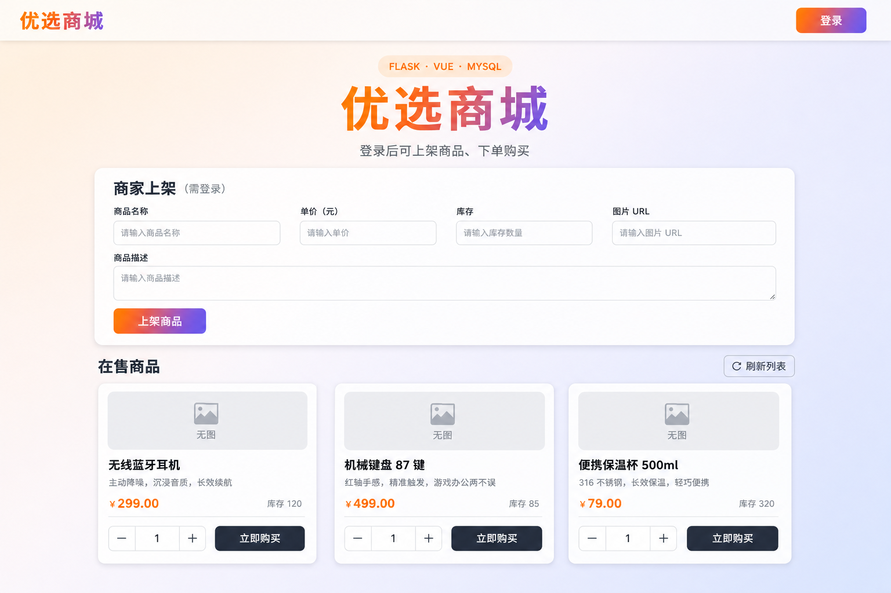
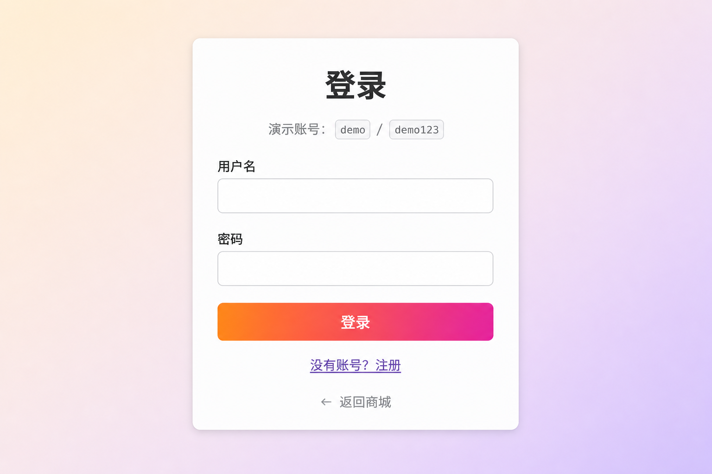

# 优选商城（web1）

前后端分离的简易电商演示：浏览与购买商品、登录后上架商品与下单。适合作为 **Flask + Vue + SQLAlchemy** 的入门脚手架；数据库可选用 **MySQL** 或本地 **SQLite**。

## 技术栈

| 层级 | 技术 |
|------|------|
| 后端 | Python 3、Flask 3、Flask-SQLAlchemy、PyJWT、PyMySQL |
| 前端 | Vue 3、Vue Router、Vite 6 |
| 数据 | MySQL（默认）或 SQLite（开发） |

## 功能概览

- 商品列表、刷新；展示价格（人民币格式）、库存与「立即购买」
- JWT 登录 / 注册；登录后可调用上架与下单接口
- 首次启动自动写入演示商品与演示用户

## 仓库结构

```
web1/
├── backend/          # Flask 应用与 API（前缀 /api）
├── frontend/         # Vite + Vue 单页应用
└── docs/screenshots/ # 界面预览图（见下文）
```

## 环境要求

- Python 3.10+（建议）
- Node.js 18+ 与 npm

## 本地运行

### 1. 后端

```powershell
cd backend
pip install -r requirements.txt
```

默认连接 MySQL（`config.py` 中可通过环境变量覆盖）。**本地快速体验**建议使用 SQLite：

```powershell
$env:USE_SQLITE = '1'
python app.py
```

服务默认监听 **http://127.0.0.1:5000**。

### 2. 前端

另开终端：

```powershell
cd frontend
npm install
npm run dev
```

开发服务器默认 **http://localhost:5173/**，并将 `/api` 代理到本机 5000 端口（见 `frontend/vite.config.js`）。

### Windows PowerShell 5 提示

若 `&&` 报错，请用分号串联命令，例如：`Set-Location backend; pip install -r requirements.txt`。

## 演示账号

| 用户名 | 密码 |
|--------|------|
| `demo` | `demo123` |

（由 `backend/app.py` 在空库时自动种子写入。）

## 界面预览

以下为项目首页与登录页的界面效果，便于快速了解页面布局与文案；若需与当前本机像素级一致，可自行启动前后端后截图并覆盖 `docs/screenshots/` 下同名文件。

**商城首页（在售商品、上架表单）**



**登录页**



